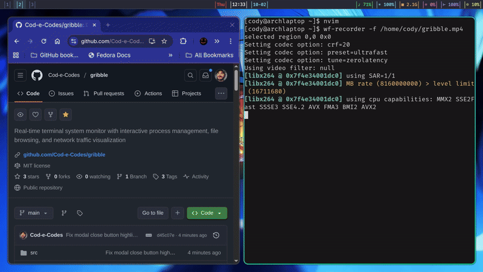

# Gribble System Monitor

A terminal-based system monitor built with Rust and ratatui. Provides real-time system metrics, process management, file browsing, and network traffic visualization.



*Animated demo showing Gribble's real-time system monitoring capabilities*

## Features

- Real-time CPU and memory monitoring with visual progress bars
- Interactive process viewer sorted by resource usage
- File system navigation with keyboard controls and directory history
- Network traffic visualization with sparkline graphs
- Multi-interface network monitoring with overflow detection
- Detail modals for processes, networks, system info, and files
- Vim-style keyboard navigation

## Installation

### Prerequisites

- Rust 1.70+ (2024 edition)
- Terminal with Unicode support

### Build from Source

```bash
git clone https://github.com/Cod-e-Codes/gribble.git
cd gribble
cargo build --release
```

### Run

```bash
cargo run
```

## Usage

### Navigation

- `←→` or `h l` - Switch between panels
- `↑↓` or `j k` - Navigate within lists, cycle network interfaces
- `PgUp/PgDn` - Jump by page in lists
- `Home/End` - Jump to first/last item in lists
- `Enter` - Open directories in File Explorer
- `Backspace` - Go up one directory
- `b` - Go back in directory history
- `i` - Show detailed information modal
- `r` - Refresh all data
- `?` - Show/hide help
- `q` or `Esc` - Quit

### Panels

1. **System Monitor** - CPU usage, memory statistics, process count, system information
2. **System Status** - Current time/date, disk usage, network interface statistics, system load
3. **Process Manager** - Live process list sorted by CPU usage
4. **File Explorer** - Directory browser with folder/file icons and navigation history
5. **Network Graph** - Real-time network traffic with interface cycling

### Detail Modals

Press `i` to show detailed information:
- **Process Manager** - Process details (PID, CPU, memory, status, command)
- **Network Graph** - Network interface details (totals, current rates)
- **System panels** - System information (hostname, OS, kernel, hardware)
- **File Explorer** - File/directory info or disk usage for mount points

## Technical Details

- Built with ratatui for terminal UI rendering
- Uses sysinfo for cross-platform system metrics
- Updates system data every 2 seconds
- Maintains 60-point history for network graphs
- Cross-platform support (Windows, macOS, Linux)
- Memory and network formatting with appropriate units
- Bounds checking and overflow protection
- String truncation for long names
- Error recovery for directory navigation
- Cached data structures for performance
- Network counter overflow detection

## Requirements

- Modern terminal emulator with Unicode support
- Minimum terminal size 80x24
- Read permissions for system information

## Releases

Pre-built binaries are available for download on the [Releases page](https://github.com/Cod-e-Codes/gribble/releases).

### Supported Platforms

- **Linux (x86_64)** - `gribble-x86_64-unknown-linux-gnu.tar.gz`
- **Windows (x64)** - `gribble-x86_64-pc-windows-msvc.zip`
- **macOS (Intel)** - `gribble-x86_64-apple-darwin.tar.gz`
- **macOS (Apple Silicon)** - `gribble-aarch64-apple-darwin.tar.gz`

### Installation

**Linux/macOS:**
```bash
# Download and extract
tar -xzf gribble-x86_64-unknown-linux-gnu.tar.gz

# Make executable and move to PATH
chmod +x gribble-x86_64-unknown-linux-gnu
sudo mv gribble-x86_64-unknown-linux-gnu /usr/local/bin/gribble
```

**Windows:**
Extract the zip file and add the directory to your PATH environment variable.

## Development

### Creating a Release

Use the included release script to create a new version:

```bash
./release.sh 1.0.0
```

This will:
- Update the version in `Cargo.toml`
- Create and push a git tag
- Trigger GitHub Actions to build and publish cross-platform binaries

## License

MIT License